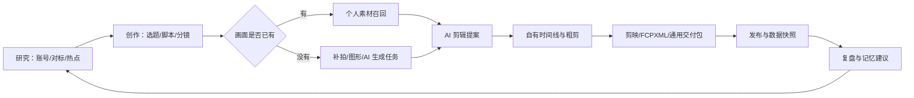
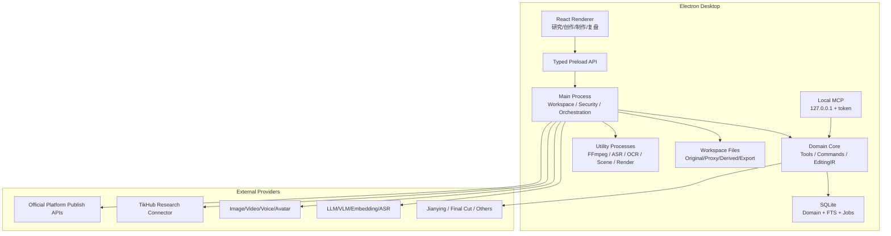

# 本地内容创作助手：深度调研与技术架构

版本：v0.1  
日期：2026-08-13  
状态：研究基线；完整技术执行方案见 [Technical-Complete-Solution-v0.1.md](./Technical-Complete-Solution-v0.1.md)

当前上游契约：[PRD-v0.2-Workflow-and-Scope.md](./PRD-v0.2-Workflow-and-Scope.md)、[Technical-Complete-Solution-v0.1.md](./Technical-Complete-Solution-v0.1.md)、[Domain-Model-and-State-Contracts-v0.1.md](./Domain-Model-and-State-Contracts-v0.1.md)、[Provider-Media-Exchange-Contracts-v0.1.md](./Provider-Media-Exchange-Contracts-v0.1.md)、[Script-Voice-and-Authenticity-Contract-v0.1.md](./Script-Voice-and-Authenticity-Contract-v0.1.md)、[Independent-Product-Review-v0.1.md](./Independent-Product-Review-v0.1.md)、[Agent-Stack-CTO-Review-v0.1.md](./Agent-Stack-CTO-Review-v0.1.md)、[Database-Decision-ADR-v0.1.md](./Database-Decision-ADR-v0.1.md)。

## 0. 最终结论

这个产品应该被定义为：

> 一个以本地素材和创作记忆为核心、由 AI 调用各类生产能力的内容创作操作系统。

第一种“内容格式配置”聚焦抖音真人深度口播，但底层不能做成口播专用软件。产品采用“通用内核 + 场景工作流包”的方式：

- 通用内核管理账号、证据、选题、脚本、分镜、素材、时间线、发布物和复盘；
- 首个工作流包是 `douyin-deep-talking-head`，提供深度口播特有的论证结构、提词、B-roll、补拍任务和抖音复盘；
- 后续可以增加访谈、测评、课程、播客切片等工作流包，不需要重做数据层和剪辑层。

最终技术方向建议冻结为：

- Electron + React + TypeScript 的 Windows/macOS 桌面端；
- SQLite 作为本地事实库，文件系统保存原始媒体和派生文件；
- FFmpeg/ffprobe 作为确定性媒体底座，Remotion 只承担适合 React 表达的字幕、图形和动效能力；
- 所有 AI、TikHub、生成服务和平台发布能力都通过可替换 Provider/Connector 接入；
- Agent 采用 `AI SDK 7 + Mastra 1.58.x` 的分层方案：AI SDK 负责模型/Provider primitives，Mastra 负责 Agent/Workflow/Memory/Eval；业务事实、权限和副作用仍由自有 Domain/Command/Job 掌握；
- `CreativeStoryboard → FrozenEditSpec → RenderIR` 是 AI 剪辑的硬边界；
- UI、内置 Agent、外部 MCP 共用同一套版本化 Tool/Command；
- 自有项目格式是唯一事实源，剪映草稿、FCPXML、MP4 等只是输出适配器。

这条路线保留了产品的通用性，同时让第一版有一个足够具体、能真正闭环的切入点。

## 1. 调研范围和证据等级

本轮调研覆盖：

1. 用户指定的本地项目 `/Users/aoqimin/Desktop/e-cut`、`/Users/aoqimin/Desktop/Nomi`；
2. 用户指定的 [Palmier Pro](https://github.com/palmier-io/palmier-pro)、[OpenChatCut](https://github.com/0xsline/OpenChatCut)；
3. OpenCut、ChatCut、OpenTimelineIO、剪映/CapCut 草稿社区项目；
4. TikHub 抖音数据 API、抖音官方发布 API；
5. OpenAI、Anthropic、Ollama、ComfyUI 等模型接口；
6. ASR、OCR、镜头拆分、全文和向量检索；
7. Descript、Captions、Riverside、剪映等口播和 AI 编辑产品。

证据按以下等级使用：

- A：官方文档、官方仓库和本地实际代码；
- B：活跃开源项目 README/代码和可复现行为；
- C：社区逆向、第三方文章和营销口径，只用于发现线索，不能成为产品承诺。

架构决策优先依赖 A/B 级证据。涉及剪映私有草稿、平台数据抓取、模型价格和许可时，必须在真正落地前重新核验。

## 2. 从本地项目中得到的关键结论

### 2.1 e-cut 值得继承的部分

`e-cut` 已经验证了几个非常重要的方向：

- 参考内容不应只保存成链接，而应拆成可编辑的分镜、证据和结构对象；
- 素材匹配要返回多个候选、匹配原因和缺口，而不是黑盒选一个素材；
- Agent 操作应是类型化、可逆的编辑命令，破坏性操作先预览；
- TikHub 应由薄适配器接入，保存原始响应和标准化结果；
- 工作流状态、产物版本、导出和编辑器回流需要可追溯；
- “素材事实”“剪辑规划”“确定性执行”必须分层。

尤其应直接继承以下思想，而不是照搬界面：

```text
素材事实/参考证据
        ↓
创意分镜与匹配候选
        ↓
可审阅的剪辑计划
        ↓
确定性编译与渲染
        ↓
产物、对齐报告和数据回流
```

本地参考：

- `/Users/aoqimin/Desktop/e-cut/docs/eccut-creation-workflow-prd.md`
- `/Users/aoqimin/Desktop/e-cut/docs/ai-edit-execution-contract-alignment.md`
- `/Users/aoqimin/Desktop/e-cut/apps/web/src/mastra/agents/editor/contracts/schemas.ts`
- `/Users/aoqimin/Desktop/e-cut/apps/web/src/server/radar/tikhub.ts`
- `/Users/aoqimin/Desktop/e-cut/research/2026-08-03_eccut-asset-ingestion.md`

本轮新增的内部复用边界审计见：[Internal-Reuse-Audit-v0.1.md](./Internal-Reuse-Audit-v0.1.md)。

### 2.2 Nomi 值得继承的部分

Nomi 更接近本产品需要的桌面运行时：Electron 主进程负责本地文件、Provider、任务和 MCP，React 渲染进程只负责界面。最值得借鉴的是：

- 本地工作区和媒体文件是第一等对象；
- 模型 Provider 可以配置、探测和测试，而不是写死某一家；
- 付费生成使用持久任务、预算预留、审批和 outbox，避免重复提交；
- MCP 只投影安全能力，不绕过产品的审批和事务规则；
- `pending / processing / submission_unknown / failed / completed` 等状态必须真实反映外部任务。

本地参考：

### 2.3 本轮仓库与本地多模态能力复核（2026-08-13）

本轮进一步核对了用户提到的 Palmier Pro（不是 Plume Pro）、ChatCut、OpenChatCut，以及两个内部仓库的真实代码。结论不是“找一个仓库整套搬过来”，而是把能力拆成四个可验证的层：

```text
平台数据/视频来源 → 本地媒体事实 → 语义理解 → 可编辑剪辑工程
```

#### 外部仓库能提供什么

| 项目 | 已确认事实 | 对本项目的可用价值 | 不能直接当作什么 |
|---|---|---|---|
| Palmier Pro | Swift 原生、macOS 26 + Apple Silicon、实时线性编辑、MCP；编辑器和 MCP GPLv3，生成式 AI 闭源/订阅 | 研究 Mac 原生媒体架构、时间线/导出/MCP 的边界、SigLIP2 等本地模型接入位置 | 不能作为 Windows 目标的底座，也不能把闭源生成服务当作开源能力；代码复用需单独做 GPL/AGPL 许可审计 |
| OpenChatCut | Electron/React/Remotion、本地项目、多轨时间线、Agent/MCP、proposal → review → apply、FCPXML/项目导出，AGPL-3.0-or-later | 研究“Agent 修改真实可编辑工程”的命令合同、审批、撤销、导出和本地运行时 | 不能替代我们的账号/选题/素材事实模型；不能把其时间线 schema 当作本项目唯一数据库 |
| ChatCut | Apache-2.0 的 Premiere UXP 插件；自然语言 → 结构化编辑动作；Provider 抽象 | 研究动作参数化、歧义处理、Provider 适配和插件边界 | 不是本地独立编辑器，也没有我们的研究、拍摄包和素材匹配闭环 |
| e-cut | 已有本地视频解构桥、PySceneDetect 主切分、TransNetV2 争议发现器、词级 ASR/OCR、三帧证据、结构化合同、检索评测和双 Worker 调度 | 是当前最直接的参考拆解/素材理解底座，可迁移“证据层、时间轴、缓存、失败隔离、人工修订” | 不能把电商裂变标签和业务假设原样带入真人口播 |
| Nomi | Electron 主进程、本地项目、Provider 目录、持久任务、MCP、审批/恢复、媒体资产本地化 | 是桌面运行时、Provider、异步任务和审批恢复的主要内部肩膀 | 不能直接把生成工作流等同于研究账号或口播剪辑工作流 |

Palmier Pro 的官方 README 明确其平台、MCP 端点、许可证和“生成式 AI 闭源”边界；OpenChatCut 的 README 明确其本地项目、可审阅编辑和 AGPL 许可证。[Palmier Pro](https://github.com/palmier-io/palmier-pro)、[OpenChatCut](https://github.com/0xsline/OpenChatCut)

#### 关于“视频拆解和账号数据来自 GitHub”的修正

GitHub 仓库可以提供下载、媒体探测、镜头切分、ASR、OCR、VLM 标注和聚合代码，但通常不会提供稳定、完整、合规的抖音账号数据。账号和作品的公开元数据仍应由 TikHub 或官方平台接口提供；本地管线负责把视频变成带时间证据的 `ReferenceVideoAnalysis`。两者要在连接器层汇合，而不是在一个“万能爬虫仓库”中耦合：

```text
TikHub/官方数据 → 视频元数据与指标快照
本地媒体管线 → 镜头、ASR、OCR、音频、视觉证据
领域层 → 单条分析、账号模式、选题机会和可追溯引用
```

这样当平台接口变化时，不会破坏本地分析；当本地模型替换时，也不会改变账号数据合同。

#### 本地 OCR/ASR/视觉能力的现实选择

| 能力 | 推荐基线 | 可选增强 | 关键限制 |
|---|---|---|---|
| OCR | 跨平台 sidecar：PaddleOCR（Apache-2.0，当前版本以实际锁定版本为准） | macOS 原生 Vision OCR；RapidOCR/ONNX 作为部署优化候选 | 花字、描边、动效字幕仍需抽帧去重、区域检测和 VLM 校准，不能把 OCR 结果当作绝对真值 |
| ASR | 现有 e-cut 的 whisper.cpp 本地路径；Apple Silicon 走 Metal/Core ML | 中文质量包评估 FunASR 的 Paraformer-zh/SenseVoice；Windows/Linux 可评估 faster-whisper | 模型权利与代码许可证分开审核；词级时间戳、VAD、热词和中文专名必须进入 Gold 评测 |
| 镜头切分 | PySceneDetect 作为主切分 | TransNetV2 只作为争议发现器；不要未经 Gold 评测直接并集 | 快切、转场、VFR 和短镜头会改变结果，必须保存 profile 和边界证据 |
| 视觉语义 | 本地 VLM/视觉模型可插拔；先用抽样帧和结构化输出 | macOS Vision/Core ML 做 OCR、人物/物体/姿态和质量检测；云 VLM 做可选深度解释 | App Store 里的视觉类 App 只能作为 UX/产品研究对象，除非存在公开 SDK/API；不能把闭源 App 当运行时依赖 |

Apple Vision 的官方文档确认文字识别、物体/人物/姿态等能力可在设备上执行；whisper.cpp 官方仓库明确支持 Apple Silicon、Metal、Core ML、CPU 和多平台；FunASR 官方仓库提供中文 Paraformer/SenseVoice 等模型，但模型权利仍需按模型卡单独核对；PaddleOCR 官方仓库提供多语言 OCR 和版本化安装路径。[Apple Vision](https://developer.apple.com/documentation/vision)、[whisper.cpp](https://github.com/ggml-org/whisper.cpp)、[FunASR](https://github.com/modelscope/FunASR)、[PaddleOCR](https://github.com/PaddlePaddle/PaddleOCR)

最终推荐是“本地事实优先、云端语义可选”，不是“所有能力必须本地”或“所有能力都交给云端”：

1. ffprobe/FFmpeg、hash、代理、镜头切分、OCR、ASR 和缓存默认可本地完成；
2. VLM 深度分析、账号聚合解释和复杂中文润色允许选择云端 Provider；
3. 每个分析产物保存 backend、model、版本、输入 hash、时间证据和置信度；
4. 本地模型未安装、显存不足或模型失败时，系统应明确显示“未分析/需要云端/失败”，而不是用模型常识补齐事实。

#### 许可与复用边界

用户希望完全开源，这并不意味着可以把所有开源仓库的代码混成一个工程。Palmier Pro 的 GPLv3、OpenChatCut 的 AGPL、Nomi 的 AGPL，以及各自的第三方依赖和模型权利必须逐项记录。当前建议：

- 优先复用接口思想、测试方法、数据结构经验和可观察行为；
- 需要实际复制代码时，先做 SPDX 清单、版权保留、依赖树和派生作品判断；
- 对高风险模块（时间线、媒体处理、模型权重、私有草稿适配）优先 clean-room 重写或独立进程调用；
- 本项目核心仍按已确认的 AGPL-3.0-only 规划，Provider/Connector SDK 可独立许可，但不把第三方许可证义务藏在“参考仓库”里。

- `/Users/aoqimin/Desktop/Nomi/README.md`
- `/Users/aoqimin/Desktop/Nomi/docs/provider-integration.md`
- `/Users/aoqimin/Desktop/Nomi/docs/superpowers/plans/2026-08-08-production-run-foundation.md`
- `/Users/aoqimin/Desktop/Nomi/electron/productionRun`
- `/Users/aoqimin/Desktop/Nomi/electron/capabilityCore`

Nomi 使用 AGPL-3.0。除非我们明确选择兼容许可证，否则只能学习架构，不能直接复制代码。

## 3. 同类产品与开源项目的有效启示

| 产品/项目 | 已验证的强项 | 对我们的启示 | 不能直接照搬的部分 |
|---|---|---|---|
| [Descript](https://www.descript.com/tools/video-editor) | 转写即时间线、删文字即删视频、去口头禅、音频修复、提词和眼神修正 | “脚本—转写—时间线”必须是同一套文本锚点 | 云端产品，不解决本地私有素材长期沉淀 |
| [Captions AI Edit](https://captions.ai/features/edit-with-ai) | 风格化一键加入 B-roll、字幕、转场、音乐、音效 | 用户需要的是可理解的风格预设，不是逐参数学习剪辑 | 结果偏黑盒，素材和决策沉淀不足 |
| [Riverside](https://riverside.fm/video-editor) | 录制、转写、去停顿、文本编辑和多平台片段 | 口播内容中音频清理和文本剪辑应先于复杂视觉效果 | 更偏录制/播客，缺少账号研究和个人素材检索 |
| [剪映](https://www.capcut.cn/) | 完整的花字、模板、音效、智能剪口播和素材生态 | 外部精修桥接比正面复制更现实 | 私有草稿格式、版本敏感、没有稳定第三方工程交换 |
| [Palmier Pro](https://github.com/palmier-io/palmier-pro) | 原生编辑器、本地 MCP、Agent 可操作真实工程 | 本地 MCP 应接真实项目而不是只提供聊天 | macOS/Apple Silicon 限制；GPLv3；生成部分闭源 |
| [OpenChatCut](https://github.com/0xsline/OpenChatCut) | Electron、多轨、Agent/MCP、提案审批、MP4/SRT/FCPXML | 与本产品最接近的编辑事务和导出参考 | AGPL-3.0，不能默认复制到其他许可项目 |
| [OpenCut](https://github.com/OpenCut-app/OpenCut) | MIT、跨端、时间线与本地存储探索 | 可参考可复用的许可边界和 Web 编辑架构 | 官方文档仍说明预览/导出在重构，不宜当成熟内核 |
| [ChatCut](https://github.com/akhil-datla/ChatCut) | 自然语言转类型化 Premiere 动作 | 意图解析必须落到有限动作注册表 | 只是 Premiere 插件，不是完整创作系统 |

行业已经证明“自动字幕、去停顿、加 B-roll、一键风格化”会快速成为标配。我们的差异不能只是多接几个模型，而必须是：

1. 账号和内容证据进入创作对象；
2. 个人素材自动拆解并能按分镜召回；
3. 缺素材时自动转为可执行补拍任务；
4. 每次剪辑和发布结果都回到同一份创作记忆；
5. 所有能力都能被 AI 可靠、可审阅地调用。

## 4. 产品信息架构

用户层只保留四个主工作区，避免把内部流水线暴露成十几个孤立功能：

1. **研究**：账号、对标、热点、参考内容、机会卡；
2. **创作**：选题、资料、脚本、提词和分镜；
3. **制作**：拍摄任务、素材库、AI 粗剪、时间线和导出；
4. **复盘**：发布物、数据快照、实验对比和记忆建议。

素材库、Provider 设置、任务中心和账号连接器是全局能力，不单独割裂为主流程。



## 5. 每项功能具体怎么设计

### 5.1 账号梳理和内容定位

不是让大模型看主页后输出一段泛泛总结，而是生成可维护的 `CreatorProfile`：

- 目标受众、内容支柱、擅长领域、可信资历；
- 观点语气、叙事结构、常用案例和禁用表达；
- 历史内容的主题、开头、时长、画面密度和表现分布；
- 当前假设和证据来源分开保存；
- 用户可以确认、驳回或修改 AI 结论。

输出不是一次性报告，而是账号策略面板和版本化快照。任何 AI 写稿都引用当前生效的 Profile 版本。

### 5.2 对标账号和赛道分析

核心对象是 `BenchmarkAccount`、`BenchmarkVideoSnapshot` 和 `PatternFinding`。

分析流程：

1. TikHub/用户链接拉取公开作品和指标；
2. 按主题、开头类型、叙事结构、时长、画面方式聚类；
3. 计算稳定模式、异常爆款和最近变化；
4. 输出“可借鉴结构”和“不可直接复制内容”；
5. 每条结论展示样本、时间窗口和置信度。

对标不是生成“你应该学他”，而是回答：对方在哪些主题上稳定、什么开头在什么样本中有效、我们有哪些能力和立场可以形成不同切口。

### 5.3 热点、选题库和机会卡

`TopicSignal` 保存来源、时间、热度曲线、相关账号、证据和过期时间。AI 将多个 Signal 组合成 `OpportunityCard`：

- 用户真实问题；
- 可讲的核心观点；
- 与账号定位的匹配原因；
- 参考样本和反例；
- 适合的内容结构；
- 时效性和风险；
- 是否进入选题库。

选题库需要状态机：`inbox → researching → ready → scripting → produced → published → reviewed → archived`。这样才能把“选题”与最后表现连接起来。

### 5.4 深度口播脚本和 AI 文案

脚本编辑器采用 Tiptap 一类结构化富文本，但底层不是一整段字符串，而是：

- `HookBlock`：冲突、承诺、反常识或问题；
- `ClaimBlock`：观点；
- `ReasonBlock`：推理；
- `EvidenceBlock`：数据、来源和引用；
- `ExampleBlock`：案例；
- `CounterpointBlock`：反方或限制；
- `ConclusionBlock`：结论；
- `CTABlock`：行动引导。

AI 操作应是“补证据、改写本段、压缩 15 秒、增强反驳、检查逻辑跳跃”等局部命令。每次修改以 diff/proposal 展示，不能整稿覆盖。

每个文本片段分配稳定 `script_span_id`，后续 ASR、字幕、分镜、素材和复盘都引用它。

脚本个性化再增加一条独立链路：`VoiceProfile → ThoughtPlan → ScriptDraft → VoiceRender → SpokenEdit → AuthenticityPass`。其中 `VoiceProfile` 来自用户选定并确认的真实样本，`ThoughtPlan` 保存观点和推理而不是漂亮句子，`AuthenticityPass` 输出风险和改写建议而不是静默覆盖原稿。这样既能贴近创作者平时的表达和思路，也能避免用泛化的“人性化”提示词制造另一种模板腔。

### 5.5 提词器

提词器是脚本的视图，不是另一份文本。它支持：

- 字号、滚动速度、镜像、段落停顿和强调词；
- 当前段落的镜头/动作提示；
- 录制后将实际 ASR 对齐到原脚本，标记漏讲、改讲和重拍点；
- 导出手机可打开的只读提词页或拍摄包。

桌面摄像头录制不是第一方案。真人拍摄仍以手机/相机为主。

### 5.6 分镜和画面意图

每个 `StoryboardShot` 必须首先说明“为什么这里要换画面”，再说明拍什么：

- 对应 `script_span_id`；
- 画面意图：举证、解释、具象化、情绪、节奏重置、遮盖跳剪；
- A-roll/B-roll/图表/屏录/示意图/生成画面；
- 建议时长、最短/最长时长；
- 景别、构图、动作、主体和场景；
- 素材权属要求；
- 搜索查询和补拍说明；
- 当前覆盖状态。

系统按以下优先级找画面：

```text
个人已授权素材
→ 用户连接的商用素材源
→ 屏录/图表/简单图形
→ AI 生成图片或视频
→ 真人补拍任务
```

AI 可以生成参考示意图，但示意图只表达构图和动作，不默认进入正式成片。

拍摄参考分三级，避免一开始把成本锁在完整 AI 视频上：

1. 默认：文字说明 + 一张构图/动作示意图；
2. 需要表现运镜时：2–4 张关键帧或低成本动态分镜；
3. 只有高价值、难理解镜头才按用户确认生成完整参考视频。

三种参考都只服务拍摄理解，生成成本、真实性和可直接用于成片的权利状态分别展示。

### 5.7 A 方案：手机/相机补拍任务

系统不控制拍摄设备，只生成 `ShootTask`：

- 要拍什么、为什么拍；
- 目标时长和建议拍摄次数；
- 横竖屏、景别、机位、运动、光线、道具；
- 示例图和常见错误；
- 文件回传后自动校验时长、方向、清晰度和是否包含目标主体。

便利性通过以下方式实现：

1. 桌面生成“拍摄包”，手机用二维码打开只读任务清单；
2. 用户仍用系统相机/专业相机拍摄；
3. 通过局域网上传、AirDrop/附近共享或监控文件夹导入；
4. 文件按任务二维码、命名规则、时间顺序或人工确认绑定到 Shot；
5. 拍完一条自动进入下一条，未过质量闸的素材保留但标为需重拍。

第一轮可用本地 HTML/二维码实现轻量拍摄包，不要求手机原生 App；但“桌面生成任务 → 手机查看/拍摄 → 回到桌面导入多个 Take”必须进入首条口播生产闭环，而不是后续独立能力。

### 5.8 个人素材库

入库状态机：

```text
imported
→ probed
→ proxy_ready
→ analyzing
→ ready | needs_attention
```

每个原文件产生不可变 `AssetRevision`，再产生多个 `AssetSegment`。后台管线依次执行：

1. SHA-256 指纹、ffprobe、方向和可变帧率检查；
2. 代理文件、缩略图、波形、胶片条；
3. 镜头边界和音频活动检测；
4. ASR 与词级/句级时间戳；
5. OCR；
6. VLM 输出受控标签和自然语言 caption；
7. 全文索引、文本 embedding 和可选视觉 embedding；
8. 人工修正产生新 Annotation 版本，不覆盖原分析。

核心标签分四层：

- 客观：景别、主体、动作、场景、画幅、时长、清晰度；
- 内容：ASR、OCR、讨论主题；
- 叙事：钩子、举证、解释、情绪、转场等角色；
- 业务：来源、项目、人物、拍摄批次、权属和用户自定义标签。

检索不是单次向量查询，而是：

```text
权属/画幅/时长/人物等硬过滤
→ FTS5 关键词召回 + embedding 语义召回
→ 融合排序
→ 对少量 Top-K 用 VLM 重排
→ 返回候选、时间段、匹配证据和不确定项
```

### 5.9 AI 粗剪

AI 剪辑分成三层：

1. `CreativeStoryboard`：创意和画面意图；
2. `FrozenEditSpec`：用户确认后的可执行合同；
3. `RenderIR`：确定性执行器的输入。

`FrozenEditSpec` 至少包含素材修订、源入出点、时间线入出点、轨道、构图、字幕、音量、转场和允许的降级。缺字段必须回到规划层，渲染器不允许临场猜测。

AI 编辑流程：

```text
Agent 读取项目事实
→ 生成 EditProposal
→ 校验能力、素材、成本和副作用
→ 用户预览 diff
→ 原子 apply
→ 可撤销命令进入历史
→ 编译 RenderIR
→ 预览/渲染/对齐检查
```

首批原子动作：切分、删除、修剪、排序、替换、插入、音量、静音、基础变速、位置/缩放、字幕、标题、硬切/淡入淡出。每增加一种效果都必须同时增加 schema、编译、渲染、降级和 golden test。

### 5.10 自有编辑器和剪映精修

自有编辑器的职责是：

- 审阅 AI 选材和剪辑计划；
- 修正镜头入出点、轨道和字幕；
- 处理基础画面和声音；
- 生成可靠的粗剪与交换包。

复杂花字、模板、商业素材、精细动效仍交给剪映。我们保留三个出口：

1. **稳定出口**：MP4/MOV + SRT/ASS + 素材清单 + manifest；
2. **标准交换**：FCPXML，后续可由 OpenTimelineIO 扩到更多 NLE；
3. **实验出口**：剪映/CapCut 私有草稿适配器。

[Apple FCPXML](https://developer.apple.com/documentation/professional-video-applications/fcpxml) 是正式 XML 交换格式；剪映草稿常见是私有 JSON/资源目录，不是 FCPXML。CapCut 官方目前明确说明跨草稿需要先导出成片，重新导入后图层不可编辑，因此不能承诺官方工程互通。[CapCut 官方说明](https://www.capcut.com/help/import-a-previous-project-into-the-current-project)

社区 [pyJianYingDraft](https://github.com/yuanmouren1hao/pyjianyingdraft) 明确提示剪映 6+ 的 `draft_content.json` 存在加密和版本兼容问题；即使社区 fork 宣称支持部分高版本，也只能作为实验适配器，并建立 Windows/macOS/剪映版本回归矩阵。

### 5.11 导出规格

用户必须同时拥有默认预设和完整自定义能力：

- 项目规格：画布、比例、帧率、时间基准、色彩空间；
- 渲染规格：容器、视频/音频编码、码率/质量、分辨率、硬件编码；
- 交换规格：FCPXML、剪映草稿、字幕和项目包。

每次导出先生成 `CapabilityReport`，说明当前系统、GPU、FFmpeg 和目标适配器支持什么、会发生什么降级。成片后保存 ffprobe 结果、编码器、输入版本、文件校验和和质量检查。

### 5.12 多平台发布

平台发布必须独立于 TikHub：

- TikHub 负责研究、公开数据和可选的创作者数据连接；
- 官方平台 Connector 负责 OAuth、上传、发布、审核状态和作品 ID；
- 没有官方权限的平台只生成“发布包 + 检查清单”，不以浏览器自动点击作为核心能力。

抖音官方内容发布方案支持第三方系统经 OAuth 上传并创建视频，但需要申请权限并获得用户授权；创建后还会经过平台审核。[抖音官方发布接入方案](https://open.douyin.com/platform/resource/docs/ability/content-management/douyin-publish-solution/)、[创建视频接口](https://partner.open-douyin.com/docs/resource/zh-CN/dop/develop/openapi/video-management/douyin/create-video/video-create)

发布前展示最终确认页：视频、封面、标题、话题、账号、定时、AIGC 标识和平台特定风险。发布属于高副作用操作，Agent 不得静默执行。

### 5.13 数据复盘和创作记忆

每个 `PublishedArtifact` 必须绑定：账号、选题、脚本版本、EditSpec、素材修订、导出配置和平台作品 ID。

系统按配置保存多个 `MetricSnapshot`，例如发布后 1 小时、24 小时、7 天。复盘展示：

- 内容表现变化，而不是只看最终累计数；
- 开头、主题、时长、B-roll 密度、CTA 等变量；
- 样本量、相关性和置信度；
- 用户主观评价和外部事件。

系统只能提出 `MemoryProposal`，例如“最近 8 条中，带具体反例的开头完播更稳定”。用户确认后才进入长期 `CreatorMemory`。小样本相关性不能被包装成因果结论。

### 5.14 音色克隆、数字人和 AIGC

这些能力应做成异步生成 Provider，而不是写进剪辑内核：

- `VoiceProfile`、`AvatarProfile` 保存 Provider ID、所有者、用途、状态和版本；
- `ConsentRecord` 保存身份、授权范围、录制证据、时间和撤回状态；
- 生成任务必须估算成本、确认后提交、保存外部 job ID，并立即下载临时 URL；
- 生成内容进入素材库时标记 provider、模型、prompt、AIGC 和权属。

OpenAI 自定义声音要求先上传同意录音；ElevenLabs 的专业声音克隆包含声音验证；这些不是可选 UI，而应成为我们的统一合规合同。[OpenAI Audio API](https://platform.openai.com/docs/api-reference/audio/updateVoiceConsent)、[ElevenLabs Voice Cloning](https://elevenlabs.io/docs/eleven-api/concepts/voice-cloning)

数字人采用与 [HeyGen V2](https://docs.heygen.com/docs/create-video-archived) 类似的异步接口：列出 avatar/voice → 提交 → 轮询/回调 → 下载 → 入库。数字人是素材来源之一，不单独建立一套项目系统。

## 6. TikHub 接入设计

### 6.1 两类连接必须分开

**公开研究连接**：使用产品或用户配置的 TikHub API Key，获取搜索、榜单、热点、作品和公开互动数据。

**自有账号分析连接**：部分创作者/指数接口需要用户的抖音创作者 Cookie。它必须是用户显式启用的高级连接，单独加密、显示有效期、可随时删除，不能与公开研究混为一谈。

### 6.2 第一批 API 能力

| 业务能力 | TikHub 接口方向 | 产品落点 |
|---|---|---|
| 赛道雷达 | 指数筛选项 + `fetch_item_query` | 按类目/时间/标签/时长找参考作品 |
| 专门搜索 | TikHub Dedicated Search | 关键词搜视频、用户、话题；不混用 Web/App 搜索 |
| 热点选题 | 创作热门话题、关键词趋势、内容趋势 | TopicSignal 和机会卡证据 |
| 链接解析 | 作品信息、分享链接解析、高清播放地址 | 建立 ReferenceVideo，不默认进入个人素材库 |
| 自有账号诊断 | 创作者诊断、作品总览、观看趋势、受众画像 | CreatorProfile 和复盘 |
| 数据回流 | 作品指标和趋势 | MetricSnapshot |

TikHub 官方说明 App V3、专门搜索、榜单/指数和创作者 API 是不同产品线；Dedicated Search 也有独立计费。[TikHub 抖音 API](https://tikhub.io/douyin-api)、[指数作品查询](https://docs.tikhub.io/443673045e0)

### 6.3 Connector 合同

```ts
interface PlatformResearchConnector {
  testConnection(): Promise<ConnectionReport>
  getFilterOptions(input): Promise<FilterCatalog>
  searchVideos(input): Promise<Page<ReferenceVideoSnapshot>>
  getVideo(input): Promise<ReferenceVideoSnapshot>
  getAccount(input): Promise<BenchmarkAccountSnapshot>
  getTopicSignals(input): Promise<TopicSignal[]>
  getMetricSnapshots(input): Promise<MetricSnapshot[]>
}
```

所有响应统一附带：

- `provider`、`provider_request_id`；
- `fetched_at`、`fresh_until`；
- 是否缓存、是否计费、估算费用；
- 原始响应 hash 和标准化版本；
- 不完整字段、权限和错误分类。

### 6.4 工程细节

- API Key/Cookie 只存在 Electron 主进程，并用系统安全存储加密；
- `baseUrl` 可配置，适应区域网络差异，但不在代码中写死未验证的镜像域名；
- 按端点设置缓存 TTL、并发、重试和预算；
- 保存原始响应用于重新标准化，UI 只读取内部 DTO；
- 需要异步导出的接口保存外部任务句柄并轮询，禁止重复提交；
- 版权参考与自有素材是两个实体，参考视频不能一键变成可用于混剪的个人素材。

`e-cut` 当前的 `tikhub.ts + normalize.ts + contracts.ts` 已经是正确起点：Bearer、超时、Zod 输入、松散响应标准化。新项目应把它升级为完整 Connector，而不是在页面里直接 fetch。

已核实的指数搜索请求可以直接形成第一条契约测试：

```http
POST {TIKHUB_BASE_URL}/api/v1/douyin/index/fetch_item_query
  ?query={keyword}
  &category_id={categoryId}
  &date_type={dateType}
  &label_type={labelType}
  &duration_type={durationType}
Authorization: Bearer {TIKHUB_API_KEY}
```

适配器只在 `code == 200` 时视为 Provider 成功，同时保存 `request_id`、缓存/计费信息和原始 payload；页面得到的是标准化 `ReferenceVideoSnapshot[]`。筛选项、创作热门话题和创作者诊断分别以官方端点文档做契约 fixture，不把 Provider 字段直接扩散到业务表。[搜索筛选项](https://docs.tikhub.io/444247760e0)、[创作热门话题](https://docs.tikhub.io/444247765e0)、[创作者诊断](https://docs.tikhub.io/359719874e0)

## 7. AI 模型和生成 API 接入

### 7.1 不做一个万能 Provider

按能力拆接口：

```text
LanguageModelProvider      文本、视觉理解、结构化输出、工具调用
EmbeddingProvider          文本/图像向量
TranscriptionProvider      ASR、说话人、时间戳
SpeechProvider             TTS、声音克隆
ImageGenerationProvider    文生图、图像编辑
VideoGenerationProvider    文/图生视频
AvatarProvider             数字人
```

OpenAI-compatible 只代表协议部分兼容，不代表所有服务都支持 Responses、视觉、严格 JSON Schema、工具调用和流式输出。每个模型都必须保存 `ModelCapabilityProfile` 并通过真实探测测试。

### 7.2 第一批协议适配器

- OpenAI Responses/Chat：文本、视觉、严格结构化输出、工具；
- Anthropic Messages：原生 tool use；
- OpenAI-compatible：国内云模型、LM Studio 等；
- Ollama：本地 `/v1/chat/completions`、`/v1/responses` 和 embedding；[官方兼容说明](https://docs.ollama.com/api/openai-compatibility)
- ComfyUI：上传工作流 JSON、`POST /prompt`，保存 `prompt_id`，通过 `/history` 或 WebSocket 获取结果；[ComfyUI 服务端接口](https://docs.comfy.org/development/comfyui-server/comms_routes)
- 独立生成厂商：统一为 submit/poll/cancel/download。

同步模型的标准调用链是 `domain input → provider request → structured output → schema validation → domain artifact`；异步生成的标准调用链是：

```text
prepare/upload references
→ estimate cost
→ user approval
→ submit(idempotency key)
→ persist provider job id
→ poll/webhook
→ download before URL expires
→ hash and import as AssetRevision
```

任何重启恢复都从本地 `ExternalJob` 读取外部句柄继续轮询，不能重新提交付费任务。

### 7.3 统一任务信封

每次模型调用记录：

- provider/model/endpoint 和能力版本；
- 输入对象版本、prompt 模板版本和 schema 版本；
- 是否发送本地素材、发送了哪些派生文件；
- token、费用、耗时、重试和外部 job ID；
- 原始输出、校验后的结构化输出和人工修订；
- `idempotency_key` 和结果 hash。

LLM/VLM 只参与“理解和规划”，FrozenEditSpec 之后的编译和渲染不再调用模型。

### 7.4 数据路由

模型设置页不是简单的 API Key 表单，而是数据策略：

- 本地优先、仅文本可上云、允许代理图上云、允许原视频上云；
- 每个任务执行前显示本次会发送什么；
- 用户可以为 ASR、视觉、写作、embedding、生成分别选择 Provider；
- 云端调用失败可以回退，但不能在未提示时把本地任务转发给另一个云服务。

## 8. 素材技术选型

### 8.1 物理和语义管线

- 元数据/转码：FFmpeg + ffprobe；
- 镜头拆分：先以 PySceneDetect/ffmpeg 基线，使用真实口播和 B-roll 素材对 TransNetV2 做 bake-off；
- ASR：本地优先。跨平台基线优先复用 `e-cut` 已验证的 whisper.cpp 路径；macOS Apple Silicon 可用 Metal/Core ML，中文质量包再评估 FunASR Paraformer-zh/SenseVoice，Windows/Linux 可评估 faster-whisper。云端 Volc/OpenAI-compatible ASR 作为显式 fallback，不作为唯一依赖；[whisper.cpp](https://github.com/ggml-org/whisper.cpp)、[FunASR](https://github.com/modelscope/FunASR)、[faster-whisper](https://github.com/SYSTRAN/faster-whisper)
- OCR：跨平台基线优先 PaddleOCR（锁定实际版本）或其 ONNX 部署路线；macOS 可选 Apple Vision 原生 OCR 以减少安装和隐私成本；花字仍需抽帧去重、区域检测和 VLM 校准，不能把任一 OCR 输出直接当成事实；[PaddleOCR](https://github.com/PaddlePaddle/PaddleOCR)、[Apple Vision](https://developer.apple.com/documentation/vision)
- 视觉打标：可配置 VLM，输出受控 schema；
- embedding：云/本地可替换，模型 ID 和维度必须随向量保存。

### 8.2 本地检索存储

选择 SQLite 的原因是单机、可迁移、可备份，不需要为个人桌面软件引入 Postgres/Redis。

- 结构化数据：SQLite + Drizzle migrations；
- 全文：SQLite FTS5；
- 向量：定义 `VectorIndex` 接口，首版可固定版本使用 `sqlite-vec` 精确检索；
- 大库升级：只有真实 10k/100k/1M 分段基准表明 P95 不达标时，才引入 ANN 或独立索引。

[SQLite FTS5](https://www.sqlite.org/fts5.html) 是稳定官方能力。`sqlite-vec` 跨 Windows/macOS 且双许可证友好，但官方仓库明确仍是 pre-v1，因此必须锁版本并隔离在适配器后。[sqlite-vec](https://github.com/asg017/sqlite-vec) SQLite 新的 Vec1 目前也明确写着测试不足，不能在没有基准和回归的情况下替换。[SQLite Vec1](https://sqlite.org/vec1/doc/trunk/doc/vec1.md)

## 9. 剪辑和交换架构

### 9.1 自有 Editing IR

不要把 FCPXML、剪映 JSON 或 Remotion Composition 当主项目格式。自有 IR 至少包含：

- rational time/timebase；
- project/canvas/output profile；
- video/audio/caption/overlay tracks；
- clip 的 asset revision、source range、timeline range；
- transform、speed、volume、effects、transition；
- script/shot/decision/provenance 引用；
- schema/version/hash。

可参考 [OpenTimelineIO](https://github.com/AcademySoftwareFoundation/OpenTimelineIO) 的对象和适配器思想。OTIO 描述剪辑决策和外部媒体引用，不承载媒体文件本身，适合作为交换层参考，不适合作为我们所有业务对象的数据库。

### 9.2 渲染后端

- 交互预览：浏览器视频元素/WebCodecs/Canvas，读取代理文件；
- 基础确定性导出：FFmpeg filtergraph；
- 字幕、品牌图形和 React 适合表达的动效：Remotion 后端；
- `RenderBackend` 注册表决定当前 Spec 需要 FFmpeg、Remotion 或混合编译；
- 同一 IR 的 preview/export 通过 golden fixture 和输出检查防漂移。

[FFmpeg](https://www.ffmpeg.org/documentation.html) 支持广泛格式、编解码和滤镜，但最终安装包能使用哪些编码器取决于我们实际打包的构建与许可证，UI 不能照抄 FFmpeg 全量列表。

### 9.3 外部适配器

```text
EditingIR
├─ RenderAdapter        → MP4/MOV/WebM/音频/字幕
├─ FCPXMLAdapter        → Final Cut Pro / 支持方
├─ OTIOAdapter          → 中立交换和后续适配器
├─ JianyingDraftAdapter → 私有、实验、版本矩阵
└─ DeliveryPackage      → manifest + media + captions + checksums
```

每个适配器返回 `CapabilityReport` 和 `LossReport`：哪些能力保留、降级、扁平化或不支持。

## 10. 领域模型和事实边界

建议首批核心实体：

```text
Workspace
├─ CreatorAccount / CreatorProfile
├─ BenchmarkAccount / BenchmarkSnapshot
├─ TopicSignal / OpportunityCard / Idea
├─ SourceEvidence / Script / ScriptSpan
├─ Storyboard / StoryboardShot / ShootTask
├─ MediaAsset / AssetRevision / AssetSegment
├─ AnnotationRevision / EmbeddingRevision / RightsRecord
├─ EditProposal / FrozenEditSpec / TimelineProject
├─ ExportProfile / ExportJob / PublishedArtifact
├─ MetricSnapshot / ReviewFinding / MemoryProposal
└─ ProviderConfig / ModelProfile / ExternalJob / ConsentRecord
```

关键规则：

1. 原始文件、分析、人工标签和任务决策分别版本化；
2. 素材的客观事实不能被一次剪辑决策污染；
3. 每个成片都能追溯到脚本、镜头、素材修订和模型调用；
4. 外部编辑结果以新版本导入，不覆盖自有历史；
5. 发布数据是观察值，记忆是经过确认的推论，两者不能混为一张表。

## 11. 最终系统架构



### 11.1 进程边界

- Renderer 不直接接触 API Key、任意文件路径或 shell；
- Main 进程负责权限、Provider、工作区和任务编排；
- FFmpeg、ASR、OCR、场景检测和渲染放 utility process/worker，不能阻塞 Main；
- Python 只作为可选分析能力包，不让主应用依赖用户电脑现有 Python；
- MCP 绑定 `127.0.0.1`，使用随机 token、会话权限和审批，不对局域网默认开放。

Electron 官方建议启用 context isolation，通过 `contextBridge` 暴露最小方法，不把 `ipcRenderer` 直接交给页面；CPU 密集服务应放 utility process。[Context Isolation](https://www.electronjs.org/docs/latest/tutorial/context-isolation)、[Process Model](https://www.electronjs.org/docs/latest/tutorial/process-model)

## 12. 最终技术栈

本章记录研究阶段的选型依据。开工时的具体版本、目录布局、进程边界、数据表、任务状态机、媒体管线、导出和分阶段执行，以 [Technical-Complete-Solution-v0.1.md](./Technical-Complete-Solution-v0.1.md) 为唯一技术基线；若本章与其冲突，后者优先。

| 层 | 选择 | 原因 |
|---|---|---|
| 桌面 | Electron，版本在开工时锁定 | Windows/macOS；本地项目中已有成熟参考；AI/媒体 Node 生态完整 |
| 前端 | React + TypeScript + Vite | 与 Nomi/OpenChatCut/e-cut 的知识资产一致 |
| 编辑器 UI | Tiptap + 自研时间线组件 | 脚本结构化，时间线受自有 IR 控制 |
| 状态 | Zustand（UI）+ Domain services（事实） | UI 临时状态不污染 SQLite 事实 |
| Schema | Zod + JSON Schema | UI、IPC、Tool、MCP 和 Provider 共用合同 |
| 数据库 | SQLite + Drizzle + FTS5 | 本地、可迁移、无需服务进程 |
| 向量 | `VectorIndex` 抽象 + 锁版本 sqlite-vec | 先满足单机精确检索，保留更换能力 |
| 媒体 | FFmpeg/ffprobe sidecar | 转码、探测、代理、音频和确定性渲染 |
| 动效 | Remotion，按需使用 | 字幕、图形和模板比纯 FFmpeg 更可维护 |
| 模型网关 | AI SDK 7/官方 SDK 封装在内部 Provider 后 | 加速多模型接入，但不让领域层依赖 SDK |
| 本地模型 | Ollama/OpenAI-compatible；可选本地能力包 | 不强迫所有用户下载模型 |
| Agent runtime | Mastra 1.58.x + 自有 Tool Registry | 提供 Agent、Workflow、Memory、MCP、Scorers/Gates 和暂停/恢复；不拥有领域事实 |
| Agent/MCP | Mastra adapter + 自有 Command Registry + MCP SDK | 内置 Agent、外部 Agent 共用能力和审批；命令注册表仍是唯一事实源 |
| 任务 | SQLite 持久队列 + outbox + worker pool | 本地软件不引入 Redis；支持恢复和防重复付费 |
| 测试 | Vitest + Playwright + contract/golden media fixtures | 验证 schema、编辑事务、跨平台和渲染一致性 |
| 打包 | electron-builder，FFmpeg/模型能力包按平台分发 | Windows/macOS 安装和可选大文件管理 |

### 12.1 为什么不是 Tauri 或 Swift

- Swift/Palmier 路线无法满足 Windows；
- Tauri 体积更小，但当前团队已有的 TypeScript/Electron、本地 Provider、MCP 和媒体流水线资产更多；
- 本产品主要风险在媒体合同、素材理解和平台适配，不在安装包少几十 MB；
- 因此 Electron 是综合风险最低的选择。若后续性能瓶颈集中出现，可将媒体核心迁到 Rust sidecar，不需要重写 UI。

## 13. 本地工作区布局

```text
<workspace>/
├─ workspace.json
├─ catalog.sqlite
├─ projects/<projectId>/
│  ├─ project.json
│  ├─ timeline.json
│  ├─ artifacts/
│  └─ exports/
├─ assets/<assetId>/<revisionId>/
│  ├─ original.ext
│  ├─ proxy.mp4
│  ├─ thumbnail.webp
│  ├─ waveform.json
│  └─ derived/
├─ cache/
├─ jobs/
└─ backups/
```

数据库保存关系和索引，文件系统保存大对象。所有写入先写临时文件并校验，再原子替换；数据库使用 WAL、迁移和周期备份。删除素材前做引用检查，默认进入可恢复的回收站。

## 14. 安全、隐私和许可

- API Key、Cookie、OAuth refresh token 使用 Electron `safeStorage` 异步接口；macOS 使用 Keychain，Windows 使用 DPAPI。[Electron safeStorage](https://www.electronjs.org/docs/latest/api/safe-storage)
- 本地媒体默认不上传；云分析明确展示派生物、Provider 和保留策略；
- 外部 MCP、付费生成、删除、导出覆盖和发布需要权限/确认；
- 所有 Provider 调用记录费用和数据去向；
- 声音和数字人必须有 ConsentRecord 和撤回流程；
- TikHub 公开抓取数据只用于研究和个人运营辅助，不把参考视频默认当可商用素材；
- Palmier GPLv3、OpenChatCut/Nomi AGPL-3.0；在开源许可证确定前只做 clean-room 设计；
- `e-cut` 根目录未发现明确 LICENSE 文件，内部复用范围也应先由项目所有者确认。

## 15. 技术验证顺序

这不是赶 MVP，而是先消灭会推翻架构的未知数。

### Spike 1：自有 IR 和三种输出

同一份 5–10 镜 `FrozenEditSpec`：

- 输出自有时间线；
- 渲染 MP4 + SRT + manifest；
- 导出 FCPXML；
- 在一组明确剪映版本上实验生成草稿；
- 形成 Capability/Loss report。

### Spike 2：本地素材检索 bake-off

使用真实口播/B-roll 素材 30–50 条、20 个分镜查询：

- 冻结人工可用素材集合；
- 比较场景拆分方案；
- 比较有/无业务上下文的 VLM 标签；
- 比较硬过滤 + FTS、+ embedding、+ VLM 重排；
- 指标为 Top-3 命中、MRR、延迟、费用和人工修正率。

### Spike 3：TikHub 契约

- 用 mock 固定 schema，再用真实 Key 联调；
- 验证指数筛选、搜索、作品解析、热点、创作者数据和异步接口；
- 记录计费、缓存、限速、错误和区域网络；
- 公共研究与 Cookie 账号连接分别测试。

### Spike 4：Provider 与持久任务

- OpenAI/Anthropic/OpenAI-compatible/Ollama 各跑一次结构化脚本任务；
- ComfyUI/一个云视频 Provider 跑 submit → resume → download；
- 在进程崩溃、网络超时和临时 URL 过期时验证不重复付费提交。

### Spike 5：跨平台媒体和安全

- Windows/macOS 中文路径、大文件、Range seek、VFR、硬件编码；
- context isolation、typed IPC、safeStorage、MCP token；
- 安装包内 FFmpeg 的许可证和实际 codec capability。

## 16. 建议的建设阶段

### 阶段 A：架构基座

- Electron 工作区、SQLite、文件存储、任务恢复；
- Provider/Connector/Tool Registry；
- 脚本、分镜、素材和 EditingIR 核心实体；
- FFmpeg 基础渲染和 CapabilityReport。

### 阶段 B：口播完整生产链

- CreatorProfile、选题和结构化脚本；
- 分镜、素材覆盖检查和 A 方案补拍任务；
- 素材拆分、ASR/OCR/标签/混合检索；
- 主口播 + B-roll + 字幕的 AI EditProposal。

### 阶段 C：研究和数据回流

- TikHub 雷达、对标、热点和参考视频；
- 抖音官方发布 Connector 或手动发布包；
- 指标快照、复盘和 MemoryProposal。

### 阶段 D：外部精修和能力扩展

- FCPXML/OTIO；
- 剪映版本化草稿适配器；
- 基础花字、模板、音效追平；
- 数字人、声音克隆、更多生成 Provider；
- 多平台发布适配器。

## 17. 主要风险和架构应对

| 风险 | 结论 | 架构应对 |
|---|---|---|
| 产品过大 | 真实存在，但不是砍掉通用性 | 通用内核 + 首个口播工作流包 |
| 剪映工程不稳定 | 高风险、无官方稳定交换 | 私有适配器实验化，FCPXML/交付包保底 |
| AI 剪辑质量不稳定 | 不能靠更长 prompt 解决 | Storyboard/EditSpec/RenderIR 分层，proposal 审批 |
| 素材标签不准 | 会直接拖垮匹配 | 受控 schema、业务上下文、人工修正和 bake-off |
| 第三方 API 价格/可用性 | 必然变化 | Provider/Connector、缓存、预算、可替换和真实状态 |
| 本地大模型门槛 | Windows/Mac 配置差异大 | 云主线 + 可下载本地能力包，不强制捆绑 |
| 平台发布权限 | 申请和审核不可控 | 官方 Connector + 发布包双轨 |
| 复盘伪因果 | 小样本很容易误导 | 保存样本/时间窗/置信度，记忆需人工确认 |
| 开源许可污染 | AGPL/GPL 项目较多 | clean-room 设计，许可决策后再决定代码复用 |

## 18. 已确认的方向决策

以下方向已经确认，后续 PRD 和技术验证按此执行：

1. **完全开源，推荐“核心 AGPL-3.0-only + 开放 SDK”**：核心桌面端、领域模型、素材库、工作流、Editing IR、内置 Agent 和官方适配器按 AGPL-3.0-only 发布；公开的 Schema、Connector/Provider SDK 和独立命令行工具可按 Apache-2.0 发布，降低社区接入门槛。两者都是开源许可证，区别是核心保持强 copyleft，而 SDK 允许更多项目复用。需要遵守修改版本提供对应源代码、保留许可证和版权声明等义务；第三方模型/Provider 的服务条款和模型许可证仍独立处理。我们不以软件授权费为第一阶段目标。
2. **BYOK 优先**：用户自行配置 OpenAI、Anthropic、通义、火山、Ollama 等 Provider 的 Key；软件不默认替用户承担模型调用费用。架构保留未来增加托管额度的接口，但不纳入当前范围。
3. **TikHub 公开数据先行**：第一阶段做热点、搜索、对标账号、作品和公开互动数据；Cookie/深层账号诊断列为高级实验能力，并且不作为主流程依赖。
4. **双平台桌面端，剪映 Windows 优先验证**：Windows 和 macOS 都是产品目标平台；稳定出口先保证 MP4、SRT、素材包和 FCPXML；剪映私有草稿适配先在 Windows 的一个明确版本上建立回归基线，再扩展 macOS 和其他版本。
5. **验证素材由项目方整理**：先从本地 `e-cut`、`Nomi`、当前工作区、公开可授权素材和公开数据集中整理 fixture；同时建立脱敏的口播/B-roll 检索集。当前已发现 `e-cut/pipeline/work/releases/material-reference-v1-86725301d408/library/assets/` 下约 788 个本地代理媒体，可作为第一轮入库、拆分、标签和检索基线；Nomi 中的产品演示视频只作为媒体导入/渲染样例，不默认当作口播质量样本。真正评估产品时仍需补充代表性真人口播样本，不能用公开素材完全替代真实用户素材。

这几项已经足够进入下一阶段的技术验证，不需要再等待其他产品方向决策。剩余问题只在验证过程中以记录形式收敛，例如具体剪映版本、Provider 价格、模型效果和素材标签命中率。

## 19. 研究来源索引

- [Palmier Pro](https://github.com/palmier-io/palmier-pro)
- [OpenChatCut](https://github.com/0xsline/OpenChatCut)
- [OpenCut](https://github.com/OpenCut-app/OpenCut)
- [ChatCut](https://github.com/akhil-datla/ChatCut)
- [OpenTimelineIO](https://github.com/AcademySoftwareFoundation/OpenTimelineIO)
- [Apple FCPXML](https://developer.apple.com/documentation/professional-video-applications/fcpxml)
- [CapCut 跨草稿说明](https://www.capcut.com/help/import-a-previous-project-into-the-current-project)
- [CapCut 2K/4K 导出](https://www.capcut.com/help/export-videos-in-capcut)
- [pyJianYingDraft](https://github.com/yuanmouren1hao/pyjianyingdraft)
- [TikHub Douyin API](https://tikhub.io/douyin-api)
- [TikHub 指数作品查询](https://docs.tikhub.io/443673045e0)
- [抖音内容发布接入](https://open.douyin.com/platform/resource/docs/ability/content-management/douyin-publish-solution/)
- [OpenAI Responses](https://platform.openai.com/docs/quickstart/make-your-first-api-request)
- [Anthropic Tool Use](https://docs.anthropic.com/ko/docs/agents-and-tools/tool-use/overview)
- [Ollama OpenAI Compatibility](https://docs.ollama.com/api/openai-compatibility)
- [ComfyUI Server API](https://docs.comfy.org/development/comfyui-server/comms_routes)
- [Electron Context Isolation](https://www.electronjs.org/docs/latest/tutorial/context-isolation)
- [SQLite FTS5](https://www.sqlite.org/fts5.html)
- [sqlite-vec](https://github.com/asg017/sqlite-vec)
- [FFmpeg Documentation](https://www.ffmpeg.org/documentation.html)
- [Qwen3-ASR](https://github.com/QwenLM/Qwen3-ASR)
- [OpenAI Whisper](https://github.com/openai/whisper)
- [whisper.cpp](https://github.com/ggml-org/whisper.cpp)
- [FunASR](https://github.com/modelscope/FunASR)
- [faster-whisper](https://github.com/SYSTRAN/faster-whisper)
- [PaddleOCR](https://github.com/PaddlePaddle/PaddleOCR)
- [Apple Vision](https://developer.apple.com/documentation/vision)
- [Descript](https://www.descript.com/tools/video-editor)
- [Captions AI Edit](https://captions.ai/features/edit-with-ai)
- [Riverside Editor](https://riverside.fm/video-editor)
- [ElevenLabs Voice Cloning](https://elevenlabs.io/docs/eleven-api/concepts/voice-cloning)
- [HeyGen Video API](https://docs.heygen.com/docs/create-video-archived)
