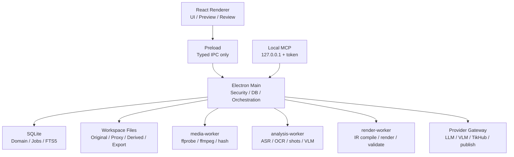

# 本地内容创作助手：技术完整方案 v0.2

版本：v0.2  
日期：2026-08-14  
状态：技术基线，供实施使用  
上游：[PRD-v0.2-Workflow-and-Scope.md](./PRD-v0.2-Workflow-and-Scope.md)、[Domain-Model-and-State-Contracts-v0.1.md](./Domain-Model-and-State-Contracts-v0.1.md)、[Provider-Media-Exchange-Contracts-v0.1.md](./Provider-Media-Exchange-Contracts-v0.1.md)、[Research-and-Architecture-v0.1.md](./Research-and-Architecture-v0.1.md)、[Agent-Stack-CTO-Review-v0.1.md](./Agent-Stack-CTO-Review-v0.1.md)、[Database-Decision-ADR-v0.1.md](./Database-Decision-ADR-v0.1.md)、[Implementation-Plan-v0.2.md](./Implementation-Plan-v0.2.md)

## 0. 先给结论

本项目采用：

```text
Electron 43 + React 19 + TypeScript 6
             │
      Typed IPC / Command Registry
             │
SQLite + Drizzle + 本地文件工作区
             │
Rust media-core + FFmpeg/ffprobe + 可选 Python 模型 sidecar
             │
Provider/Connector：本地模型、云模型、TikHub、平台发布
```

技术定位不是“一个网页套壳的 AI 剪辑器”，而是一个本地优先的内容生产操作系统：

```text
研究证据 → 选题与内容知识 → 脚本 → 分镜/拍摄包
→ ASR/OCR/视觉素材库 → 可审阅 AI 粗剪
→ 自有时间线 → MP4/SRT/FCPXML/OTIO/交付包
→ 发布数据 → 实验与创作记忆
```

核心原则：

1. TypeScript 负责产品控制面、UI 和领域编排；AI SDK 7 负责模型/Provider primitives，Mastra 负责 Agent/Workflow/Eval 编排；
2. Rust 只负责跨平台确定性核心：时间、媒体探测、编辑 IR 编译和高频计算；
3. Python 只作为模型能力 sidecar，不成为主应用运行前提；
4. SQLite 是本地事实库，文件系统是媒体事实库；
5. LLM/VLM 只产生结构化提案，正式编辑和渲染不再调用模型；
6. 所有第三方能力都通过稳定的 capability/modelKey 接入；
7. 一切重要输出都保存来源、版本、状态、参数摘要和 hash。

## 1. 技术栈决策

### 1.1 版本基线

版本使用“主版本锁定、补丁版本更新”的策略。开工时写入 `engines`, lockfile 和构建清单，不使用 `latest`。

| 层 | 选择 | 基线 | 说明 |
|---|---|---|---|
| JavaScript runtime | Node.js | 24 LTS | 开发、工具和主进程统一；不使用 EOL 版本 |
| 桌面壳 | Electron | 43.x | Windows/macOS，启用 sandbox/contextIsolation；补丁版本随安全公告更新 |
| UI | React | 19.x | 复用现有 scaffold 与 Nomi/OpenChatCut 经验 |
| 构建 | Vite | 7.x | renderer 和开发服务器 |
| 类型 | TypeScript | 6.x strict | `noUncheckedIndexedAccess`、`exactOptionalPropertyTypes`、`verbatimModuleSyntax` |
| 包管理 | pnpm | 10.x | workspace monorepo、锁文件和依赖审计 |
| 数据库 | SQLite | 系统库/打包库 | WAL、foreign keys、FTS5 |
| ORM | Drizzle ORM | 锁版本 | schema、迁移、类型推导；不把 ORM 类型当领域合同 |
| SQLite driver | better-sqlite3 | 锁版本 | 只在 main/utility 使用，打包时执行 Electron ABI rebuild |
| 校验 | Zod + JSON Schema | 锁版本 | Zod 运行时校验，JSON Schema 用于工具、Provider 和 fixture |
| 模型接口 | AI SDK | 7.x stable | 只在 Provider adapter 层使用；领域层不依赖 `ai` 或厂商 SDK |
| Agent runtime | Mastra | 1.58.x stable | Agent、Workflow、Memory、MCP、Scorers/Gates；只运行在 main/worker |
| UI 状态 | Zustand | 锁版本 | 只存临时 UI 状态和查询缓存；事实写入 domain service |
| 文本编辑 | Tiptap | 锁版本 | 结构化 ScriptBlock，不直接把 HTML 当脚本事实 |
| 媒体 | FFmpeg/ffprobe | 每个平台锁定构建 | 探测、转码、代理、音频抽取、渲染和校验 |
| 高性能核心 | Rust | stable toolchain + Cargo.lock | `media-core` sidecar；首版不引入 Rust UI |
| 动效 | FFmpeg + ASS/SVG 为默认 | — | 保证开源和交付稳定；Remotion 为可选模板适配器 |
| 端到端测试 | Playwright | 锁版本 | Electron 用户任务和浏览器手机拍摄包 |
| 单测 | Vitest / Rust cargo test | 锁版本 | JS/TS 合同与 Rust 时间/IR 核心 |
| 打包 | electron-builder | 锁版本 | DMG、NSIS、便携包；模型包按需下载 |

Electron 43 已官方发布并内置 Node 24.17，Node 24 仍是 LTS；Electron 官方同时明确 renderer/main 分离、context isolation、typed preload 和 utility process 的边界。[Electron 43](https://www.electronjs.org/blog/electron-43-0)、[Electron Process Model](https://www.electronjs.org/docs/latest/tutorial/process-model)、[Node.js Releases](https://nodejs.org/en/about/previous-releases)

### 1.2 为什么选择 Electron，而不是 Tauri 或 Swift

| 方案 | 结论 | 原因 |
|---|---|---|
| Electron | 采用 | Windows/macOS 一套 UI；TypeScript、MCP、Provider、媒体工具和现有 Nomi/OpenChatCut 经验最多 |
| Tauri | 暂不采用 | 包体更小，但引入 Rust UI/IPC 学习和生态分裂；不能直接解决媒体、模型和编辑合同问题 |
| Swift/AppKit | 仅作为 macOS 可选能力 | Palmier Pro 证明原生路线强，但无法满足 Windows；Vision/Core ML 通过 adapter 接入即可 |
| 浏览器/SaaS | 不采用 | 本地媒体、隐私、离线、账号数据和项目事实无法由纯 Web 最稳妥地承载 |

Electron renderer 必须使用 `contextIsolation`、sandbox 和最小 `contextBridge`，不能暴露整个 `ipcRenderer`；FFmpeg、OCR、ASR、渲染等 CPU/崩溃风险任务放 utility process。Electron 官方明确推荐这条进程边界。[Context Isolation](https://www.electronjs.org/docs/latest/tutorial/context-isolation)、[utilityProcess](https://www.electronjs.org/docs/latest/api/utility-process)

### 1.3 为什么保留 Rust，但不把所有东西都写 Rust

Rust 只解决三个问题：

- 时间、帧率、速度、VFR、半开区间和帧舍入的确定性；
- `FrozenEditSpec → ResolvedEditSpec → RenderIR` 编译；
- 大量媒体索引、区间运算和哈希的性能与内存边界。

Rust 不负责：

- React UI；
- Provider 参数翻译；
- TikHub 业务逻辑；
- 提示词和模型编排；
- 任何只属于产品工作流的状态。

这样不会形成“两套业务逻辑”，也不会让所有产品变化都需要同时修改 Rust 和 TypeScript。

## 2. 系统进程与目录结构

### 2.1 进程图



### 2.2 目标目录

```text
video-platform-copilot/
├─ apps/
│  └─ desktop/
│     ├─ src/renderer/              # React UI
│     ├─ src/preload/               # typed contextBridge
│     ├─ src/main/                  # Electron lifecycle and IPC
│     ├─ src/main/db/               # SQLite connection/migrations
│     ├─ src/main/jobs/             # durable scheduler/outbox
│     ├─ src/main/security/         # safeStorage, path, SSRF, audit
│     └─ src/main/mcp/              # local MCP server
├─ packages/
│  ├─ domain/                       # entities, commands, invariants
│  ├─ contracts/                    # Zod/JSON Schema/event envelopes
│  ├─ providers/                    # model/provider/connector adapters
│  ├─ media/                        # media ports and worker protocols
│  ├─ agent-tools/                  # UI/Agent/MCP shared commands
│  ├─ exchange/                     # RenderIR/FCPXML/OTIO/delivery pack
│  ├─ ui/                           # shared visual components/tokens
│  └─ workflows/                    # douyin-deep-talking-head playbook
├─ native/
│  └─ media-core/                   # Rust time/IR/media-core sidecar
├─ tools/
│  ├─ python/                       # optional ASR/OCR/VLM sidecars
│  └─ fixtures/                     # redacted media and contract fixtures
├─ docs/
├─ scripts/
└─ package.json
```

禁止出现：`renderer → fetch(TikHub)`、`renderer → fs`、`page → sqlite`、`LLM → 任意 JSON 文件`、`render → 临时调用 LLM`。

### 2.3 Electron 边界

`preload` 只暴露按能力命名的方法，例如：

```ts
type DesktopAPI = {
  workspace: {
    getSummary(): Promise<WorkspaceSummary>;
    chooseRoot(): Promise<PickRootResult>;
  };
  jobs: {
    submit(command: CommandEnvelope): Promise<JobReceipt>;
    cancel(jobId: JobId): Promise<void>;
    subscribe(listener: (event: JobEvent) => void): () => void;
  };
  media: {
    import(paths: string[]): Promise<ImportReceipt[]>;
    openPreview(assetId: AssetId): Promise<SafeMediaUrl>;
  };
};
```

不暴露 `ipcRenderer`、`fs`、`child_process`、数据库连接、credential reference 或任意 shell。

## 3. 本地数据和文件系统

### 3.1 工作区布局

```text
<workspace>/
├─ workspace.json
├─ catalog.sqlite
├─ projects/<projectId>/
│  ├─ project.json
│  ├─ storyboard/<revision>.json
│  ├─ edit/<revision>.json
│  └─ exports/<exportId>/
├─ assets/<assetId>/<revisionId>/
│  ├─ original.ext
│  ├─ proxy-720.mp4
│  ├─ thumbnail.webp
│  ├─ waveform.json
│  ├─ transcript.json
│  ├─ ocr.json
│  └─ shots.json
├─ references/<referenceVideoId>/
├─ packages/<capturePackageId>/
├─ cache/providers/<provider>/<inputHash>/
├─ jobs/<jobId>/
└─ backups/
```

数据库保存关系、状态、版本和索引；文件保存大对象。每个写入都采用临时文件、fsync/校验、原子 rename，再提交数据库指针。

### 3.2 数据库表

核心表不是三个库，而是一张内容生产图谱：

```text
workspace
creator_profiles / voice_profiles
accounts / account_snapshots
source_evidence / benchmark_videos / benchmark_video_analyses
content_units / topic_opportunities
projects / scripts / script_blocks
storyboards / shots / capture_packages / shoot_tasks / takes
assets / asset_revisions / asset_segments / annotations / embeddings / asset_usage
edit_proposals / frozen_edit_specs / render_irs / exports
publications / metric_snapshots / experiments / review_memory
provider_configs / model_descriptors / external_jobs / audit_events
```

所有可编辑实体具备：

```ts
type Versioned = {
  id: string;
  revision: number;
  status: string;
  createdAt: string;
  updatedAt: string;
  sourceRunId?: string;
  contentHash?: string;
};
```

### 3.3 数据库硬约束

- `PRAGMA foreign_keys=ON`；
- `journal_mode=WAL`；
- 每个 command 带 `expectedRevision`；
- revision 冲突返回 `CONFLICT_STALE_REVISION`，不覆盖；
- 原始素材、对标证据、发布快照不物理删除；
- FTS5 只做召回，不取代 rights/tenant/media-kind/format 硬过滤；
- 向量索引保存 `modelKey`、`dimension`、`inputHash`、`createdAt`，模型更换必须新建索引。

SQLite FTS5 是官方提供的全文检索模块，适合本地内容、ASR、OCR 和脚本搜索。[SQLite FTS5](https://www.sqlite.org/fts5.html)

## 4. 领域模型和工作流

### 4.1 四类事实

```text
ObservedFact   本地媒体、平台数据、ASR、OCR、用户输入
Inference      VLM/LLM/规则推断
UserDecision   用户接受、修改、否决
Artifact       任务产物、导出物、缓存和报告
```

推断不得覆盖事实。用户修改产生新 revision，不覆盖模型原始产物。

### 4.2 核心关系

```text
Account
  → AccountSnapshot
  → BenchmarkVideo
  → VideoAnalysisEvidence
  → PatternFinding / TopicOpportunity
  → ThoughtPlan / Script
  → Storyboard / Shot
  → ShootTask / CapturePackage / Take
  → Asset / AssetSegment
  → EditProposal
  → FrozenEditSpec
  → RenderIR / Export
  → Publication / MetricSnapshot
  → Experiment / ReviewMemory
```

### 4.3 工作流状态

```text
Project:
idea → planning → writing → storyboard → capture → rough_cut
      → review → exported → published → reviewed → archived

Asset:
importing → probed → proxy_ready → analyzing → ready
         → needs_attention → archived

AI Job:
queued → preparing → submitted → polling → downloading
      → validating → completed
      → retryable_failed / failed / cancelled / submission_unknown

EditProposal:
draft → generated → user_review → accepted / partially_accepted / rejected

FrozenEditSpec:
draft → frozen → compiled → rendered → validated → delivered
```

状态由 main/job service 维护，不由 UI 猜测。任何外部提交在 `submission_unknown` 时禁止自动重复提交，必须先查询或由用户确认恢复策略。

## 5. 媒体智能管线

### 5.1 导入和规范化

1. 用户选择文件或拖拽目录；
2. main 校验路径、大小、扩展名和真实 MIME；
3. 计算 SHA-256；
4. `ffprobe` 读取容器、轨道、时长、fps、旋转、色彩和音频布局；
5. 原始文件复制到 workspace，生成 `AssetRevision`；
6. 生成 proxy、poster、waveform 和 audio extract；
7. 创建后台分析任务，导入本身不等待 AI。

### 5.2 结构分析

- `PySceneDetect` 作为默认镜头切分器；
- `TransNetV2` 仅产生争议边界队列；
- 参考视频 profile 使用更短边界阈值，个人素材使用可复用片段阈值；
- 每个 shot 保存 `[startMs, endMs)`、evidence frame paths 和 detector/version；
- VFR 文件先经过时间基准归一化，不能按帧号直接当毫秒。

### 5.3 ASR

默认本地后端：

```text
macOS/Windows baseline: whisper.cpp
Chinese quality pack: FunASR Paraformer-zh / SenseVoice
GPU optional: faster-whisper
Cloud fallback: Volc/OpenAI-compatible ASR
```

ASR worker 规则：

- 一个常驻 worker 批量处理多个素材；
- cache key = `assetContentHash + audioStreamHash + backend + model + params`；
- 输出 word/segment 两级时间戳；
- 另存 VAD、语言、speaker 和 hotword 参数；
- 未识别或低置信度写 `needs_review`，不伪造文本；
- 脚本对齐只读取 ASR 原文，不读取 LLM 改写稿。

### 5.4 OCR

默认跨平台后端为 PaddleOCR，macOS 可选 Vision adapter。视频 OCR 不是逐帧盲跑：

```text
抽帧 → 帧差/SSIM 去重 → 字幕/花字区域检测
→ OCR → 文本相似度合并 → 时间区间回填
→ VLM 对“文字的作用”做解释
```

保存 `text`, `bbox`, `confidence`, `startMs`, `endMs`, `frameEvidenceIds`, `backend`。OCR 原文不可由 VLM 改写。

### 5.5 视觉分析

每个 shot 默认传首/中/尾三帧；短镜头用中帧。VLM 输出固定 schema：

```ts
type ShotVisualAnnotation = {
  shotId: string;
  subjects: string[];
  scene: string[];
  actions: string[];
  shotSize: "wide" | "full" | "medium" | "close" | "extreme_close" | "unknown";
  cameraMove: "static" | "pan" | "tilt" | "push" | "pull" | "follow" | "unknown";
  visualRole: "a_roll" | "b_roll" | "proof" | "example" | "context" | "transition" | "graphic" | "unknown";
  evidenceFrameIds: string[];
  confidence: "low" | "medium" | "high";
};
```

业务标签（如观点证据、案例、CTA）只在完整成片或有上下文时生成；原始碎片不强行打营销角色。

### 5.6 检索

检索固定为五级漏斗：

```text
rights / media-kind / orientation / duration 硬过滤
→ 受控标签过滤
→ FTS5 召回
→ embedding 召回
→ VLM rerank + matchedEvidence
```

结果必须返回候选原因：匹配到的 ASR/OCR、视觉标签、分镜角色、时长差和权利状态。不能只返回一个分数。

## 6. 对标账号分析管线

### 6.1 数据来源分层

```text
TikHub Connector：账号、作品列表、公开指标、搜索、热点
Media Ingest：可分析的视频文件、缩略图、临时 URL、本地证据
Analysis Pipeline：ASR/OCR/shot/audio/VLM
Domain Aggregator：账号级模式、选题机会、证据引用
```

TikHub 是公开研究 Connector，不是登录态发布器。账号发布单独实现 `PublishingConnector`。临时 URL 下载后立即本地化，保存来源和过期时间，不把 URL 当资产路径。

### 6.2 分析任务

```ts
type BenchmarkAnalysisRequest = {
  accountId: string;
  sample: {
    mode: "latest" | "latest_plus_performance";
    count: 20 | 30 | 50 | 100;
    windowDays?: number;
  };
  depth: "metadata" | "standard" | "deep";
  outputProfile: "douyin_deep_talking_head" | "generic";
};
```

默认 `latest 30 + standard`。账号级深度分析不能只依赖绝对播放量，必须保存视频年龄、账号快照和样本窗口。

### 6.3 输出

- `BenchmarkVideoAnalysis`：每条视频的指标、文本、镜头、视觉和音频证据；
- `PatternFinding`：带 scene/shot evidence 的模式观察；
- `TopicOpportunity`：用户可采用、反向或差异化的选题机会；
- `CoverageReport`：有多少视频、镜头、ASR/OCR 和视觉字段成功；
- `CostReport`：模型、tokens、时长、缓存命中和失败成本。

分析页面分成：账号总览、视频列表、单条视频时间线、模式卡、机会卡和证据抽屉。报告不直接写入用户素材库。

## 7. AI 任务与 Provider

### 7.1 Provider 接口

```ts
interface CapabilityProvider {
  descriptor(): ProviderDescriptor;
  health(input: HealthInput): Promise<HealthResult>;
}

interface StructuredModelProvider extends CapabilityProvider {
  generate<T>(request: StructuredRequest<T>): Promise<StructuredResult<T>>;
}

interface AsyncMediaProvider extends CapabilityProvider {
  submit(request: MediaRequest): Promise<ExternalJobReceipt>;
  poll(job: ExternalJobReceipt): Promise<ExternalJobState>;
  download(job: ExternalJobReceipt): Promise<DownloadedArtifact>;
  cancel?(job: ExternalJobReceipt): Promise<void>;
}

interface ResearchConnector extends CapabilityProvider {
  search(input: ResearchSearchInput): Promise<ResearchResult>;
  snapshotAccount(input: AccountSnapshotInput): Promise<AccountSnapshotResult>;
  listWorks(input: ListWorksInput): Promise<BenchmarkWorkResult>;
}
```

### 7.2 Provider 路由

领域层只写：

```text
capability = "structured_text"
modelKey = "creator-default-writer"
dataPolicy = "text_only" | "proxy_frames" | "original_media"
```

Provider adapter 负责：

- endpoint；
- auth；
- model internal ID；
- request translation；
- polling/status translation；
- errors；
- cost accounting；
- raw response redaction。

模型目录保存 `modelKey`, `providerKey`, capabilities, input/output kinds, parameter schema, source URLs and checkedAt。OpenAI-compatible 不意味着结构化输出、视频输入、工具调用和异步任务全部兼容。

### 7.3 AI 任务分工

| 任务 | 模型角色 | 输出 |
|---|---|---|
| 账号模式总结 | LLM + structured evidence | PatternFinding |
| 选题生成 | LLM | TopicOpportunity |
| 脚本 | LLM + Creator/VoiceProfile | ScriptRevision |
| 分镜 | LLM + Shot policy | StoryboardRevision |
| 素材匹配 | FTS/vector + VLM rerank | CandidateSet |
| 粗剪 | LLM/规则生成提案 | EditProposal |
| 渲染 | 无模型 | RenderIR → media |
| 数据复盘 | 规则 + LLM | Experiment/MemoryProposal |

所有结构化输出执行：

```text
request → provider → raw response
→ schema validation → invariant validation
→ normalized artifact → user review
```

### 7.4 Agent runtime 边界

Agent runtime 采用 `@mastra/core@1.58.x`，模型调用通过 AI SDK 7 和内部 Provider adapter；Mastra 只负责 Agent、Workflow、Memory、MCP、审批暂停/恢复和评测编排，不拥有领域事实或媒体任务队列。

```text
Mastra Tool
  → CommandEnvelope（packages/agent-tools）
  → Domain service / permission check
  → SQLite transaction 或 Job/outbox
  → Receipt / event / artifact
```

对话线程、workflow snapshot、tool approval 和运行追踪使用独立的 `agent-runtime.sqlite`；账号、选题、脚本、分镜、素材、时间线和发布数据仍只写入产品自己的 `catalog.sqlite`。Mastra Memory 不得自动升级为创作记忆，必须经过 `review_memory.propose → user.accept → domain.persist`。

媒体导入、TikHub 下载、ASR/OCR/VLM、FFmpeg 和导出继续由产品自己的 Job/outbox 与 worker 执行；Mastra Workflow 可以编排这些 Job，但不直接承载大文件、外部付费任务或不可幂等的副作用。

## 8. 持久任务、成本和恢复

### 8.1 SQLite outbox

所有长任务写入：

```ts
type Job = {
  id: string;
  kind: JobKind;
  inputHash: string;
  state: JobState;
  attempt: number;
  providerKey?: string;
  externalJobId?: string;
  idempotencyKey?: string;
  progress?: number;
  cost?: CostSummary;
  error?: NormalizedError;
  createdAt: string;
  updatedAt: string;
};
```

提交外部 Provider 前先写 outbox；提交后立即落外部 job ID；重启从 outbox 恢复，不从 UI 状态恢复。

### 8.2 错误分类

```text
VALIDATION_FAILED       输入或 schema 错误，不重试
AUTH_FAILED             凭证失效，暂停并提示
RATE_LIMITED            有限指数退避
UPSTREAM_5XX            有上限重试
DOWNLOAD_EXPIRED        重新下载或重新提交，需区分费用
SUBMISSION_UNKNOWN      先查询，禁止盲目重复提交
LOCAL_PROCESS_CRASH     重启 worker，使用 checkpoint
MEDIA_INVALID           进入 needs_attention
CANCELLED               用户取消，不视为失败
```

### 8.3 成本账

每次模型调用保存预估和实际：

- provider/model；
- 输入媒体 hash；
- token/秒数/帧数；
- 估算成本；
- 成功后实际成本；
- 重试成本；
- cache hit；
- 用户是否批准。

UI 显示“本任务预计发送什么、预计消耗多少、失败是否收费”。

## 9. AI 粗剪和编辑架构

### 9.1 四层对象

```text
CreativeStoryboard   创意分镜：想拍什么
FrozenEditSpec       用户确认：具体用哪些素材、哪些时间区间
ResolvedEditSpec     编译结果：解析后的媒体路径、帧、时间和效果
RenderIR             渲染中间表示：统一轨道、片段、字幕、图形和音频
```

### 9.2 粗剪算法

```text
1. 根据 scriptBlock/shot 查询 A-roll 和 B-roll
2. rights、media-kind、画幅、质量、时长硬过滤
3. FTS/vector 召回候选
4. VLM 对 Top-K 做视觉角色重排
5. 根据 ASR 时间码对齐口播
6. 规则生成保守的 A-roll + B-roll 方案
7. LLM 只解释节奏、覆盖和替代方案
8. 输出 EditProposal
9. 用户接受/替换/拒绝
10. 冻结后由 Rust 编译 RenderIR
```

默认口播剪辑策略：A-roll 连续优先、视觉变化服务观点、不为了增加切点而切镜头、缺少素材时输出缺口而不是生成事实。

### 9.3 Agent 命令

UI、内置 Agent 和 MCP 共用一套命令：

```text
project.create
account.analyze
topic.create_from_finding
script.generate_proposal
script.accept_revision
storyboard.generate
capture_package.export
asset.import
asset.search
take.select
edit.propose
edit.accept_proposal
edit.replace_candidate
edit.freeze
render.preview
render.export
publication.create_package
review.record_metrics
```

Agent 的 Tool 外壳可由 Mastra 或 AI SDK 实现，但命令注册表和 `CommandEnvelope` 才是唯一事实源；任何 Agent 框架都不能绕过权限、`expectedRevision`、幂等键和审阅状态。

破坏性命令必须返回 proposal 或要求确认；每个命令都带 `expectedRevision`、`commandId`、`actor` 和结构化 receipt。

## 10. 渲染和导出

### 10.1 默认渲染器

核心使用 FFmpeg + ASS/SVG：

- 视频、音频、转场和裁剪由 FFmpeg filtergraph；
- 字幕由 ASS 或 SVG 生成；
- 花字样式由 `CaptionStyleSpec` 统一转换；
- 预览可使用 WebGL/canvas，但预览和正式渲染共享 RenderIR；
- Remotion 只作为可选模板/动效 adapter，不作为项目事实源。

Remotion 适合 React 参数化视频和浏览器预览，但其许可证和商业使用条件必须单独审核，因此不把它放进核心强制依赖。[Remotion](https://www.remotion.dev/)

### 10.2 稳定输出

首批稳定输出：

- MP4 H.264/H.265（按平台能力）；
- AAC/WAV；
- SRT/VTT；
- 封面和缩略图；
- 原素材引用与代理交付包；
- FCPXML；
- OTIO；
- `manifest.json` + `CapabilityReport`。

### 10.3 剪映适配器

剪映/CapCut 草稿是实验适配器：

```text
JianyingAdapter(version, platform)
→ draft
→ LossReport
→ open/reopen/export smoke result
```

未建立固定版本矩阵时，不宣称支持。FCPXML/OTIO/MP4/SRT/交付包是可靠保底。CapCut 官方说明不支持直接导入/导出第三方项目文件，因此私有草稿不能成为内部事实源。[CapCut 官方说明](https://www.capcut.com/help/how-to-export-pro-project)

## 11. 安全、隐私和许可证

### 11.1 安全

- API key、TikHub key、OAuth token 只进 main 的 `safeStorage`；
- renderer 只获得 `configured/credentialRef`；
- 所有本地 URL 使用受控协议，不暴露任意路径；
- 下载器做 SSRF 防护、重定向限制、MIME 校验、大小上限和 ffprobe 校验；
- TikHub 参考视频不默认进入可商用素材库；
- 本地 MCP 只绑定 `127.0.0.1`，随机 token、会话权限和命令 allowlist；
- 日志只存脱敏 provider 元数据、hash 和状态，不存 key、cookie 和完整用户原文。

### 11.2 开源边界

- 核心桌面端、领域模型、媒体合同、Agent 工具和官方 adapter：AGPL-3.0-only；
- 独立 Provider/Connector SDK 和 schema 工具：可 Apache-2.0；
- 第三方开源代码保留 SPDX、NOTICE 和原始许可证；
- 模型权重、FFmpeg 构建、字体、Remotion 和平台 SDK 单独做许可证清单；
- Mastra 核心按 Apache-2.0 依赖管理；不引入 Mastra Enterprise/Cloud 代码，单独审计其传递依赖；
- Palmier/OpenChatCut 只在完成许可证审计后复用代码；默认采用接口研究和 clean-room 重写。

## 12. 实施阶段

这不是“能不能做”的验证排期，而是按依赖关系施工，保证每一阶段都留下可运行的工程产物。

### 阶段 0：工程基座

产物：

- pnpm workspace；
- Electron 43 主/渲染/preload；
- SQLite/Drizzle 迁移；
- safeStorage、日志、备份、路径服务；
- typed IPC、command registry、job/outbox；
- `packages/agent-runtime`：Mastra 1.58.x adapter、Agent/Workflow 注册、独立运行时存储和评测 fixture；
- electron-builder Windows/macOS 打包骨架。

必须先固定：ID、revision、事件、错误码、文件路径和 workspace schema。

### 阶段 1：媒体智能内核

产物：

- import/probe/hash/proxy/waveform；
- Rust media-core；
- FFmpeg utility process；
- PySceneDetect + TransNetV2 争议队列；
- whisper.cpp ASR worker；
- PaddleOCR/Vision OCR worker；
- transcript/ocr/shots 详情页；
- FTS5 + vector adapter；
- media fixture 和 golden output。

### 阶段 2：对标账号和内容研究

产物：

- TikHub Connector mock/real adapter；
- account snapshot、benchmark video、metrics snapshot；
- 最新几十条采样任务；
- 单条视频多模态分析；
- 账号模式卡、证据抽屉、TopicOpportunity；
- 失败/限流/缺少视频/部分分析完成状态。

### 阶段 3：内容创作工作流

产物：

- CreatorProfile、VoiceProfile、ContentUnit；
- 选题 → ThoughtPlan → ScriptBlock；
- 提词器文本视图；
- Storyboard/Shot；
- CapturePackage 手机网页/二维码/图片导出；
- ShootTask、Take、多条重拍和选中逻辑。

### 阶段 4：素材检索和 AI 粗剪

产物：

- AssetSegment 和 usage history；
- 分镜角色到素材候选的混合检索；
- ASR 对齐 A-roll；
- EditProposal、候选替换和缺口报告；
- proposal review/apply/undo；
- FrozenEditSpec。

### 阶段 5：自有时间线和交付

产物：

- RenderIR 编译器；
- timeline preview；
- FFmpeg/ASS/SVG 渲染；
- MP4/SRT/VTT/manifest；
- FCPXML/OTIO；
- CapabilityReport；
- 剪映单版本实验 adapter + LossReport。

### 阶段 6：发布、复盘和记忆

产物：

- 手动发布包；
- 平台官方发布 Connector；
- Publication、MetricSnapshot、Experiment；
- 用户确认的 ReviewMemory；
- 选题、脚本、镜头和素材使用结果回流。

### 阶段 7：扩展能力

- 多平台分发；
- 音色克隆和数字人；
- AIGC B-roll；
- 更多工作流包；
- 团队协作和可选同步服务。

## 13. 工程质量门

### 13.1 每个模块必须有

- 正常路径；
- 空输入；
- 重复提交；
- 超时；
- 取消；
- 崩溃恢复；
- revision 冲突；
- 部分失败；
- 版本迁移；
- 可观察 receipt。

### 13.2 媒体质量门

- ffprobe 结果有效；
- 代理可播放；
- ASR/OCR 时间戳不越界；
- shot 不重不漏；
- VFR 不出现累积漂移；
- RenderIR 时间区间合法；
- 输出文件存在、可重新打开、时长/轨道/编码符合 profile。

### 13.3 AI 质量门

- structured output schema pass；
- observed fact 不被推断覆盖；
- 每个 pattern 有 evidence；
- 每个素材候选有 matched evidence；
- 粗剪缺口可解释；
- 用户接受/修改/拒绝可回放；
- 不能用“模型输出成功”冒充“用户结果成功”。

### 13.4 运行命令

```text
pnpm install
pnpm lint
pnpm typecheck
pnpm test
pnpm test:contracts
pnpm test:media
pnpm test:e2e
pnpm build
pnpm package:mac
pnpm package:win
```

当前 scaffold 的 `npm` 命令迁移到 pnpm workspace 时，保留 `npm run` 兼容别名，避免旧文档和贡献者入口立即失效。

## 14. 明确不做的技术决策

- 不上微服务、Kubernetes、Redis、Postgres；这是本地桌面产品，不需要分布式基础设施；
- 不把 Python 环境作为安装前置条件；模型 sidecar 必须可选、可探测、可降级；
- 不训练自有大模型作为第一阶段前置；先用 Provider、规则、结构化输出和用户反馈；
- 不把 CapCut/Jianying 私有 JSON 当项目格式；
- 不让 Agent 直接写 SQLite、JSON、FCPXML 或剪映草稿；
- 不用“所有视频全量送云端 VLM”作为默认管线；
- 不为了追求功能数量先做数字人、音色克隆、自动发布和模板生态。

## 15. 这份方案冻结后的下一步

1. 将当前 scaffold 迁移为 `apps/desktop + packages/*` workspace；
2. 先实现 `Workspace / Asset / Job / Command` 四个基础合同；
3. 将 e-cut 的媒体事实层和 Nomi 的任务/Provider 经验按 clean-room 方式落入新包；
4. 写出第一批 SQLite migration、Zod schema、Rust media-core 接口和 worker 协议；
5. 再开始实现对标分析、拍摄包和粗剪 UI。

这之后的工作不再是“选技术栈”，而是按本方案逐层实现、测试、打包和迭代。

## 16. 官方与内部参考

- [Electron 43](https://www.electronjs.org/blog/electron-43-0)
- [Electron Process Model](https://www.electronjs.org/docs/latest/tutorial/process-model)
- [Electron Context Isolation](https://www.electronjs.org/docs/latest/tutorial/context-isolation)
- [Electron utilityProcess](https://www.electronjs.org/docs/latest/api/utility-process)
- [Node.js Releases](https://nodejs.org/en/about/previous-releases)
- [TypeScript 6.0](https://www.typescriptlang.org/docs/handbook/release-notes/typescript-6-0.html)
- [SQLite FTS5](https://www.sqlite.org/fts5.html)
- [Database Decision ADR](./Database-Decision-ADR-v0.1.md)
- [Implementation Plan v0.2](./Implementation-Plan-v0.2.md)
- [User Journey Failure Test Cases](./User-Journey-Failure-Test-Cases-v0.1.md)
- [Remotion](https://www.remotion.dev/)
- [whisper.cpp](https://github.com/ggml-org/whisper.cpp)
- [FunASR](https://github.com/modelscope/FunASR)
- [PaddleOCR](https://github.com/PaddlePaddle/PaddleOCR)
- [Apple Vision](https://developer.apple.com/documentation/vision)
- [OpenChatCut](https://github.com/0xsline/OpenChatCut)
- [Palmier Pro](https://github.com/palmier-io/palmier-pro)
- [ChatCut](https://github.com/akhil-datla/ChatCut)
- [CapCut project exchange](https://www.capcut.com/help/how-to-export-pro-project)
- [内部 e-cut](/Users/aoqimin/Desktop/e-cut)
- [内部 Nomi](/Users/aoqimin/Desktop/Nomi)
